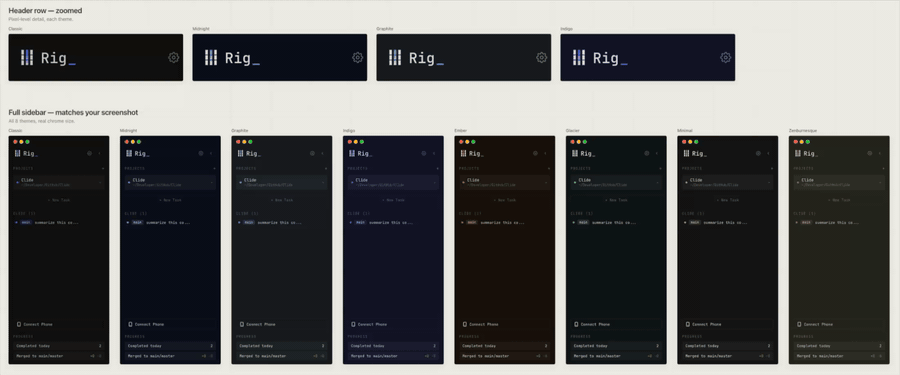

# Rig — Brand

## Product

**Rig** is a desktop app (macOS/Linux) for orchestrating multiple AI coding CLI agents in parallel. The visual identity is developer-native: dark-first, single-accent, rectilinear, and monospace-adjacent. Think control room for code, not marketing-forward SaaS.

## Personality

Calm in motion. Terminal-adjacent but modern — sharp typography, deliberate geometry, confident negative space. No playful gradients, illustrations, or assistant-mascot energy.

## Logo — Parallel Pipes

Three vertical pipes with two horizontal notches cutting through them. The outer pipes use the theme's foreground color; the center pipe uses a vertical gradient in the theme's accent range. The notches are transparent gaps — the pipe is split into three stacked segments so whatever surface is behind shows through.

See the logo **concept** below:



The metaphor: **three agents running in parallel, with one active**.

### Geometry

```
viewBox:          0 0 44 56
Pipe width:       8
Pipe x positions: 4, 18, 32
Pipe segments:    y=4  height=15   (top)
                  y=21 height=14   (middle)
                  y=37 height=15   (bottom)
Notch gaps:       y=19-21 and y=35-37 (transparent)
```

### Wordmark

- **Font:** JetBrains Mono, weight 500
- **Text:** `Rig_` — "Rig" in foreground + a blinking underscore in the theme's deeper accent
- **Underscore:** weight 600, colored `var(--logo-gradient-top)`, blinks at 1.1s with `steps(2)` (hard on/off, no fade — matches a terminal cursor)
- **Letter-spacing:** 0
- **Baseline:** aligned to vertical center of the pipe mark
- **Gap between mark and wordmark:** ~8–16px depending on size

The cursor animation is defined in `src/styles.css` as `@keyframes rigLogoBlink` and applied via `.rig-logo-cursor`.

## Color System

### Primary Palette — "Classic" (default theme)

| Role                   | Hex       | Notes                                                        |
| ---------------------- | --------- | ------------------------------------------------------------ |
| **Accent / Signature** | `#4c6fff` | Electric indigo — the single signature color, used sparingly |
| Accent hover           | `#3a5bff` |                                                              |
| Accent text (on-color) | `#ffffff` | Use on indigo fills                                          |
| Link                   | `#6b8aff` |                                                              |

### Neutrals (Classic dark base)

| Role             | Hex       |
| ---------------- | --------- |
| Background deep  | `#161618` |
| Surface elevated | `#2d2e32` |
| Surface island   | `#242428` |
| Surface hover    | `#3a3c40` |
| Surface selected | `#3e508a` |
| Border           | `#393b3f` |
| Border subtle    | `#2d2e32` |

### Foreground

| Role         | Hex       |
| ------------ | --------- |
| Text primary | `#cccdd2` |
| Text muted   | `#8b8d93` |
| Text subtle  | `#6d7076` |

### Semantic

| Role    | Hex       |
| ------- | --------- |
| Success | `#2fd198` |
| Warning | `#ffc569` |
| Error   | `#ff5f73` |

### Signature Background

Classic uses a flat `#161618` background — utilitarian, monochrome, and unapologetically terminal-adjacent. Other themes (Graphite, Indigo, Ember, Glacier) use radial-gradient app backgrounds for depth; Classic intentionally doesn't.

## Theme Matrix

All 8 themes ship with the product. Each supplies a foreground color and a two-stop gradient that drives the logo's center pipe. Outer pipes + wordmark use the theme `--fg`.

| Theme        | Pipe / Text | Gradient top | Gradient bottom |
| ------------ | ----------- | ------------ | --------------- |
| Graphite     | `#d7e4f0`   | `#0ea5e9`    | `#a7ecff`       |
| Midnight     | `#d7e4f0`   | `#0ea5e9`    | `#a7ecff`       |
| Classic      | `#cccdd2`   | `#3a5bff`    | `#b8c5ff`       |
| Indigo       | `#deddff`   | `#5a58e6`    | `#d4d3ff`       |
| Ember        | `#f2ddd1`   | `#e05a15`    | `#ffd28a`       |
| Glacier      | `#e5eff5`   | `#1fb5a5`    | `#b8f5ee`       |
| Minimal      | `#ececec`   | `#a89d7c`    | `#ece4cc`       |
| Zenburnesque | `#dcdccc`   | `#a86e6e`    | `#ebc7c7`       |

**Gradient direction:** top → bottom. `y1=0` (top, deeper color), `y2=1` (bottom, paler color).

```svg
<linearGradient id="rig-logo-gradient" x1="0" y1="0" x2="0" y2="1">
  <stop offset="0%"   stop-color="var(--logo-gradient-top)"/>
  <stop offset="100%" stop-color="var(--logo-gradient-bottom)"/>
</linearGradient>
```

## Typography

- **Display / wordmark:** JetBrains Mono (500) — the brand voice is code
- **UI:** Sora (400/500/600)
- **Alt UI:** Inter (used by Classic and Minimal themes)
- **Mono:** JetBrains Mono (400/500)

## In-App Implementation

The logo is implemented as a SolidJS component at `src/components/RigLogo.tsx` and used in:

- `src/components/Sidebar.tsx` — sidebar header with wordmark
- `src/components/WindowTitleBar.tsx` — frameless titlebar, mark only

The component uses CSS variables (`--fg`, `--logo-gradient-top`, `--logo-gradient-bottom`) so it recolors instantly when the user switches themes — no re-render, no JS, no file swap.

```tsx
import { RigLogo } from './RigLogo';

<RigLogo size={24} />                           // mark + wordmark
<RigLogo size={14} showWordmark={false} />      // mark only
```

The theme variables are defined in `src/styles.css` under each `html[data-look='<theme>']` selector.

## Runtime Dock Icon (macOS only)

On macOS, the Dock icon recolors at runtime to match the active theme. Implementation (`src/lib/dockIcon.ts`):

1. Build an SVG string with the active theme's colors
2. Rasterize to a 1024×1024 PNG in the renderer via an HTML canvas
3. Send the data URL via IPC (`IPC.SetDockIcon`) to the main process
4. Main calls `app.dock.setIcon(nativeImage.createFromDataURL(...))`

Wired up via a `createEffect` in `src/App.tsx` so it fires on every theme change.

**Platform notes:**

- **macOS only.** `app.dock` doesn't exist on Linux/Windows — the effect is a no-op on those platforms (gracefully skipped).
- **Finder/Launchpad/About** still show the baked `icon.icns` (static). Only the _running_ Dock icon updates.
- **Persists for the session.** On app relaunch, the Dock shows the baked icon again until the theme effect fires.

## Bundled App Icon (macOS / Windows / Linux)

The Dock/taskbar icon baked in at build time is what users see in Finder, Launchpad, Windows Start menu, and Linux launchers. It's static. The **Classic** variant is the canonical brand asset.

### Canonical icon spec

```
Canvas:      1024×1024, full-bleed
Background:  #0f0f0f (Classic base — near-black for maximum Dock contrast)
Outer pipes: #cccdd2
Center pipe: linear gradient #3a5bff (top) → #b8c5ff (bottom)
No:          drop shadows (macOS adds its own), outer borders, transparent margins
```

### macOS icon gotchas

- **Corner radius:** macOS Big Sur+ expects a rounded squircle. `electron-builder` does **not** apply this mask — the rounded corners must be baked into the source raster. `build/icon.svg` uses `rx="200"` on the 1024×1024 canvas (~19.5%), which approximates Apple's squircle closely enough for a full-bleed developer-tool icon.
- **Full-bleed edges:** artwork goes all the way to the canvas edge. Transparent margins render as a tiny icon floating in empty space.
- **No drop shadow.** macOS adds its own. Baked-in = double shadow.

## Sizes and Export Workflow

### In-app

One SVG component handles every size — scales from 14px (titlebar) up to 40px+ (sidebar, settings, onboarding).

### Bundled app icon

Design at one canvas size — the build pipeline generates the rest from a 1024×1024 master.

### Files

```
src/assets/logo.svg               ← in-app favicon / standalone SVG (Classic canonical)
src/components/RigLogo.tsx        ← in-app logo component (theme-reactive)
build/icon.svg                    ← design source (1024×1024, squircle-rounded)
build/icon-squared.svg            ← pipes-only variant (transparent background)
build/icon.png                    ← 1024×1024 master raster (regenerate from SVG)
build/icon.icns                   ← macOS bundle (regenerate via iconutil)
build/icon.ico                    ← Windows bundle (regenerated by electron-builder)
build/128x128.png                 ← Linux legacy path
build/128x128@2x.png              ← Linux retina
```

### Workflow

1. Edit `build/icon.svg` (the design source — already includes the squircle mask).
2. Regenerate the rasters from the SVG:
   ```sh
   cd build
   rsvg-convert -w 1024 -h 1024 icon.svg -o icon.png
   rsvg-convert -w 128  -h 128  icon.svg -o 128x128.png
   rsvg-convert -w 256  -h 256  icon.svg -o 128x128@2x.png
   ```
3. Regenerate `icon.icns` (macOS) — `electron-builder` does **not** apply the macOS squircle, so the rounded corners must already be baked in:
   ```sh
   mkdir icon.iconset
   for s in 16 32 128 256 512; do
     rsvg-convert -w $s      -h $s      icon.svg -o icon.iconset/icon_${s}x${s}.png
     rsvg-convert -w $((s*2)) -h $((s*2)) icon.svg -o icon.iconset/icon_${s}x${s}@2x.png
   done
   iconutil -c icns icon.iconset -o icon.icns
   rm -rf icon.iconset
   ```
4. `npm run build` — the built app bundle picks up the updated rasters automatically.

## Small-Size Legibility

At 16px (Dock zoomed out, favicon, menu bar), three parallel pipes with transparent notches can visually merge. Options:

- **Ignore it.** Dock minimum is ~32px in practice. 16px is mostly favicon territory where this still reads.
- **Ship a micro variant** with thicker pipes and no notches for the 16/32px slots in the `.icns` manifest.

Recommended: start with the single-source workflow. Add micro variants later if legibility bothers you in practice.

## Favicon

The in-app `src/assets/logo.svg` doubles as the favicon (referenced from `index.html`). It uses hard-coded Classic colors rather than CSS variables so it renders correctly outside the Electron context.

## Summary

- **One SolidJS component** (`RigLogo`) for in-app use, theme-reactive via CSS variables
- **One 1024×1024 SVG** exported to PNG for the bundle — `electron-builder` handles the rest
- **Classic is the canonical brand variant** for static/external assets (also the default theme)
- **Near-black background** (`#0f0f0f`) only for the Dock icon tile; nowhere else inside the app
